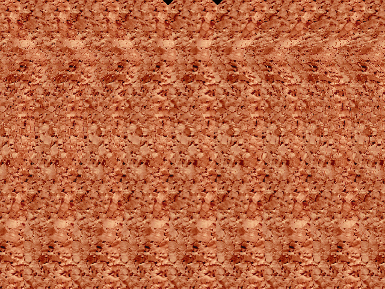

# SIS - Single  Image  Stereogram  generator
SIS is a program for generating pictures with a 3-dimensional effect which can
be perceived without using any supplementary technical devices. At a first
glance a SIS image looks like random patterns or noise, but if you know how to
view them correctly you can see a 3-dimensional shape in it. This can be
achieved by converging your eyes to look at a more distant point behind the
screen while focusing at the distance of the screen. However, it needs a little
training. If you know those "Magic Eye" books, you know what to do. Here's an
example:

By default, the background of the SIS is made of random black and white dots
but you can also set a colored texture-map instead. The depth information of
the 3-D objects can be read from a grayscale image. Examples of depth-maps are
provided in the repo. The most far distance in the depth-map is coded as black
while the nearest points should be white. Depth-maps can be created with a
ray-tracer or 3D-modeling software.

## Supported file formats
* tiff - for input, output and texture
* tga  - for input

## Requirements
* libgr (at least version 1.3)

## Installation
Build from sources:

* Change to the src directory
* Edit the Makefile to change the path for libgr, and where you might want
  to install the binary and man-page.
* type 'make'.
* type 'make install' to install the binary and man-page (as root). Instead of
  installing, you can also run the sis excecutable directly from the src directory.

## Usage
Generate a SIS of a simple 3-D sinus oval figure which is supplied in the
depthmaps subdirectory:

     ./sis ../depthmaps/oval.tif out.tif

Invoked with the -m option, sis adds two triangles to the top of the
picture, which help you to find the right convergence.

     ./sis ../depthmaps/oval.tif out.tif -m

Use a texture instead of the random noise background:

     ./sis ../depthmaps/oval.tif out.tif -t ../textures/cork.tif

To see all available options run sis without any arguments.

## Printing a SIS
  You can size and choose the resolution of your SIS with the -x, -y options.
  For example, if your printer has 300dpi, use:

     ./sis ../depthmaps/oval.tif out.tif -x40i300 -y30i300

  which gives a picture of size 4x3 inch at 300 dpi. Note that 40 means
  40 tenths of an inch = 4 inch.

Let me know if you have any suggestions, bugs, improvements, questions, new
SIS-algorithms, fancy depth- and texture-maps.
